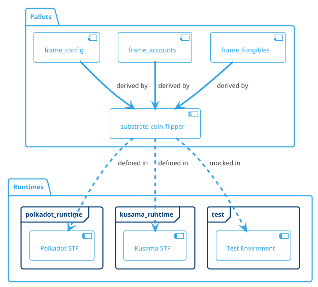
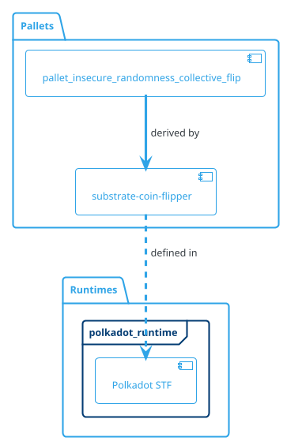

## Substrate from scratch, seriously
#### A series of tutorials to grasp and learn Substrate. Part 1

Let's get our hands dirty and build a coin-flipper project from scratch using the Substrate framework.


*The pleasure of flipping a coin, before Substrate.*

My experience with the [Polkadot Blockchain Academy](https://polkadot.network/development/blockchain-academy/) in Hong Kong was terrific (and I *strongly, strongly* recommend everyone interested [to apply and participate](https://polkadot.network/development/blockchain-academy/])).

Following the lectures of skilled instructors, I had the opportunity to delve deep into [the internals of Polkadot and Substrate](https://polkadot-blockchain-academy.github.io/pba-content/hong-kong-2024/index.html). Polkadot is built on a modular and customizable foundation, resulting in a more adaptable and *evolutionary* technology. Frankly, it makes Ethereum and Bitcoin, with their monolithic and static concepts, look like prior-generation technologies.

Substrate, the [SDK framework](https://github.com/paritytech/polkadot-sdk) we are going to use, serves as a pre-built, customizable 'scaffolding' blockchain node. It contains a large collection of modules, called "pallets", that encapsulate essential blockchain functions like networking, token management, consensus, and others.

Substrate simplifies the process, *hides a lot of complexity* and allows developers to create their own layer-1 blockchain, focusing solely on the runtime logic. However, **such an innovative approach comes at a cost**. While a lot of complexity is concealed, developers still need to know exactly what they are doing. This leads to a steep learning curve... similar to Rust.

On the one hand, Substrate has plenty of built-in engines, that makes it a breeze to write a layer-1 chain runtime logic. On the other hand, the *type system* and all the *pallet configuration* details may be a bit tricky to understand at first. Delving deep into pallet code and documentation, you can easily **get lost** due to the numerous associated types you have to deal with.

**So, I decided to create Substrate tutorials that I wish I had before building my first Substrate app.** This tutorial might be biased because it describes my personal experience, but I hope my efforts prove useful in understanding more this remarkable technology.

Let's create step by step a Substrate coin flipper. **Why a coin flipper?** It's a common [smart contract example](https://github.com/paritytech/ink-playgroung-flipper/blob/main/lib.rs), and my aim is breaking down complex concepts into simpler ones to make it easier to understand how to start to develop a Substrate pallet. We'll also add some random logic to make it fancier and plenty of tests.

**TLDR**: You can just dive in the final code [here](https://github.com/davassi/substrate-coin-flipper.git). Please feel free to leave comments!

### Let's start: setting things up.

1. If you are reading this, I'm taking the assumption you know already how to use git, so just clone somewhere **precisely** this repository:

```bash=
$ git clone https://github.com/substrate-developer-hub/substrate-node-template
```

Here you have to rename the directory from substrate-node-template to something more meaningful, like **substrate-coin-flipper**.

2. I take the assumption that you have rust installed, so just type cargo build it and let's run our node to check everything is working correctly:

```bash=
$ cargo build 
$ cargo run
```

The first time, it will take a while to compile. 
Now, go to exactly to this file:

```bash=
$ {YOUR_DIRECTORY_PROJECT}/substrate-coin-flipper/pallets/template/src/lib.rs
```

Here's where all our custom pallets live.

3. Here is the place that things get interesting, it's the core of our application where we are going to define all the logic of our application.
Please take some time to study and get familiar with this file: there are 5 Areas defined by macros that are super important to understand. I'm gonna break them down:

```rust=29
#[pallet::pallet]
```
* This is the pallet definition. It is literally a placeholder you must always specify.

```rust=32
#[pallet::config]
```

* This is the configuration pallet, the part we're going to have a lot of ~~struggle~~ fun with. We'll have our own section on it.

```rust=59
#[pallet::storage]
```
* It's the storage model where you record your structured data model. Storage is pretty fun and interesting to play with and call logic is very straightforward. 

```rust=75
#[pallet::error]
```
* This is a simple list of errors that logic can rise under certain conditions.

```rust=83
#[pallet::call]
```
* And here is where all the logic of the app is defined. Also this part is very pleasant to write.

This is the bare minimum of knowledge required to build a substrate pallet. My personal experience is that all these areas are fairly straightforward, apart from the careful consideration of the type system and configuration pallet as mentioned above.

There are a lot of other macros `(#[pallet::hooks], #[pallet::genesis_config], #[pallet::genesis_build])` that are not essential for our case and they will be material for the next tutorials.

Ok so far, so good.

### The Config: where the things are starting to get a little "unusual".

Logically, if I want to do a coin flipper, obviously I want to define a **coin** to *flip* (yep, I can define it easily with a struct) but where do I define it? 

We must never forget that we are dealing with a blockchain, therefore we need always to think in terms of data ledger that needs to be stored (using Storage) and transactions that change the state of this data (the Extrinsics).

Therefore we need to create a `Coin` entity and associate it with my account in the storage.

Now it's the time to dig into **the type system** and the **Configuration**. So, now how do I get my account? I need to identify my account ID but first I need to find out where is defined the Account type!

**In any FRAME pallet the Config trait is always generic over T** and this allows our pallet logic to be completely agnostic to any specific implementation details.  The configuration of our pallet will eventually be defined and made concrete at a later stage, in the runtimes or in the mocks for the tests, a pattern that somehow resembles *dependency injection*.



This is where things get interesting, and IMHO the official documentation does not emphasise this part enough. The config of our palettes contains all the specifications and information that is referenced and derived by different Pallets. All types and constants that go in here are generic. If the pallet depends on specific other pallets, then their configuration traits must be added here to our implied trait list.

And how we will see, most of the most common associated generic types definitions are centralised in a common pallet called the **frame_system** pallet.

Ok, now it seems even more complicated that it is.

Let's recap:

1. Any pallet has a configuration **composed by associated types.**
2. Our pallet declares a new configuration that **can derives the associated types** of the dependency pallets. 
3. The Runtime is the place where **we give a specific definition (trait implementation or value) to all the associated types** of the configuration of our pallet.

The Config trait of our pallet is where we define how the runtime or other pallets can provide concrete types or implementations for the abstract concepts defined in our traits.

From the [official documentation](https://docs.substrate.io/learn/accounts-addresses-keys/):

> `"The properties [...] can be defined generically in the frame_system module. The generic type is then resolved as a specific type in the runtime implementation, and eventually assigned a specific value. [...] The AccountId type remains a generic type until it is assigned a type in the runtime implementation for a pallet that needs this information."`

What does it mean? It means that the pallet called **frame_system** contains all the associated generic type declaration that we need, and we just need to use them inside our pallet and associate to a concrete type in our Runtimes.

So if I check the file frame/system/src/libs.rs I find out that is already defined an associated type called `AccountId`, that is also extended by plenty of other traits. 

So inside my Config I will need to use over **a generic T** that extends the frame_system the account id in the form 

```rust=16
T::AccountId  
```

and because **T belongs to the frame_system** pallet, therefore we can write it as:
```rust=16
<T as frame_system::Config>::AccountId  
```

that is even more handy to redefine as 
```rust=16
type AccountIdOf<T> = <T as frame_system::Config>::AccountId;
```

**`<Type as Trait>::item`** means accessing the **item** on **Type**, disambiguating the fact that it should come from an implementation **Trait** for **Type**.
    
That's it. Once you have understood this concept, configuration becomes pretty straightforward, 
as in the extrinsic logic, we can use `AccountIdOf<T>` anytime we need to refer to accounts.

It will only at Runtime that **AccountId will be associated to a concrete trait implementation.**

### The Config: a little deeper into the nested generic associated types

At this point, we need to briefly discuss more complex generic associated types, which will be useful for future substrate development topics.

Let's consider **BalanceOf<T>** defined as:

```rust=
type BalanceOf<T> =
    <<T as Config>::Currency as Currency<<T as frame_system::Config>::AccountId>>::Balance;
```

At first glance, it may seem intimidating, but it is the same as **`<Type as Trait>::item`**, repeated three times. In fact, we can express the type in this manner:

```rust=
type ConfigCurrency<T> = <T as Config>::Currency;
type ConfigAccountId<T> = <T as frame_system::Config>::AccountId>;
type BalanceOf<T> = <ConfigCurrency<T> as Currency<ConfigAccountId<T>>::Balance;
```
    
Let's recap and visualise it in a diagram:
* **type BalanceOf<T**>: This defines a type alias named `BalanceOf` that is generic over `T`.

* **<T as Config>::Currency**: This part specifies that we are referring to the `Currency` associated type from the `Config` trait as implemented by `T`.
* **as Currency<<T as frame_system::Config>::AccountId>>**: This further specifies that the `Currency` type we just referred to should itself implement the `Currency` trait. It is generic over the account identifier type, which is provided by `AccountId`.
* **::Balance**: Finally, this part accesses the `Balance` associated type of the `Currency` trait. This `Balance` type is what is actually used to represent the amount of currency (e.g., tokens or coins) an account has.

Let's recap it visually:


Putting it all together, `BalanceOf<T>` is a type alias for the balance type used by a pallet's currency system, where the pallet configuration is provided by T. This allows the type to work at **Runtime** with different currency representations. 
    
This is a common pattern for type definition in substrate development.
    
### The Config: The only constant in life is change
**
A typical use case (that we won't use in the coin-flipper) is the definition of a constant supported by the trait `Get`:

```rust=
#[pallet::config]
pub trait Config: frame_system::Config {
    // Here we specify they type of a very useful u32 constant...
    type VeryUsefulConstant: Get<u32>;
}
```
Once defined in our `Config` pallet, we can jump in the runtime file to specify the concrete implementation of this associated type with a value, for instance `42`:

```rust=
/// Configure the pallet-flipcoin
impl pallet_dex::Config for Runtime {
    // 
    type VeryUsefulConstant = ConstU32<42>;
}
```
Noteworthy is that this comes very handy at the moment we need to execute some tests, therefore we just configure a Mock runtime to test the pallet.

### The Storage: a handy place to write down in our blockchain.

Now it's the time to define our data model: a `CoinSide` enum that define `Head` and `Tail` and a `Coin` struct that holds one of these 2 values. Both types extend the `Default` traits, therefore I expect a default implementation when I build an object from these types. In this particular case, we have chosen to create a `Coin` that always starts with `Head`.

```rust=45
#[derive(Clone, Encode, Decode, Eq, PartialEq, RuntimeDebug, MaxEncodedLen, TypeInfo, PartialOrd, Default)]
enum CoinSide {
    #[default]
    Head,
    Tail,
}
#[derive(Clone, Encode, Decode, Eq, PartialEq, RuntimeDebug, MaxEncodedLen, TypeInfo, PartialOrd, Default)]
pub struct Coin {
    side: CoinSide,
}

```

It is generally always a good practice to define your data model in terms of meaningful `structs` and `enums` and not use storage just to store scattered `unsigned ints` or `floats` values.

Now I can define a mapping between an `Account` and a `Coin`, through the definition of a `StorageMap`: 

```rust=45
#[pallet::storage]
pub type CoinStorage<T> = StorageMap<_, Blake2_128Concat, AccountIdOf<T>, Coin, OptionQuery>;
```

This is literally simple as using any `HashMap`, but effectively we are storing data in the ledger of our blockchain app. 
    
The `StorageMap` is not the only type of data structure available and it offers a lot of flexibility (`ValueQuery`, `OptionQuery`). The part 2 of this tutorial will be dedicated extensively to the `Storage`, but I want to clarify a couple of points:

1. As anyone can notice immediately, the enum `CoinSide` and the struct `Coin` are filled with derived macros: `Clone, Encode, Decode`, etc... all these macros are necessary to allow our types to be used inside a `Storage`.
2. The Storage uses `Blake2_128Concat`. This is a hashing algorithm we are using for `StorageMap`. There are several hashing functions with different properties. All material for Part 2 tutorial.

### The Extrinsics: changing state to our blockchain from external world.

So far so good, but how do we specify the logic that implements our flipcoin pallet? We need to implement special kind of transactions, called "Extrinsics", that are essentially state transition functions that are callable externally from our blockchain.

Generally we can split these "calls" into 3 groups: 

A. Public calls that are called and signed by an external account. 

B. Root calls that are allowed to be made only by the governance system.

C. There's also another type, the unsigned transactions, that we won't cover here now.

We are going to write only extrinsics of type A. The business logic defines the behaviours of our pallet, as here is where the "macro magic" enables agents from external world to interact with our blockchain. Extrinsics are simply a broader term for transactions. 

We will define the following calls: 

* **`create_coind`** to create a coin for the sender's account and save it in the StorageMap
* **`flip_coin`** to flip the coin (head to tail or tail to head) and update the coin with the new value.
* **`toss_coin`** to toss the coin (random head or tail) and update the coin with the new value.

When writing these functions, we can follow a structure. Before starting it's important to remember one key rule: **"Do not panic!"** (interpret this in any possible way you can).


```rust=
#[pallet::call_index(0)]
#[pallet::weight(T::WeightInfo::do_something())]
pub fn create_coin(origin: OriginFor<T>) -> DispatchResult {
    let who = ensure_signed(origin)?;
    Self::do_create_coin(&who)?;
    Self::deposit_event(Event::CoinCreated { who });
    Ok(())
}
```

As you can see every single Extrinsics have a defined flow structure. 
The business logic of the extrinsic is wrapped around some functions. 
In particular we have:

```rust=1
#[pallet::call_index(0)]
```
 
* Every extrinsic starts with a derive macros called `call_index(counter)`, where counter is an incremental number. This annotation specifies the index of the call within the pallet. The index is used to identify the call uniquely when it's invoked. 

```rust=2
#[pallet::weight(T::WeightInfo::do_something())]
```

* We use a macro that specifies the weight of the call, which is a measure of the computational and storage resources required to execute the call (It will be covered in the part 2 tutorial)

```rust=3
pub fn create_coin(origin: OriginFor<T>) -> DispatchResult {
    let who = ensure_signed(origin)?;
```

* In the function we define the `create_coin` function and we ensure the call is from a signed origin. It takes an origin parameter of type `OriginFor<T>` and returns a `DispatchResult`
    
```rust=5
Self::do_create_coin(&who)?;
```

* We invoke the business logic defined within `impl<T: Config> Pallet<T> {}`

```rust=6
Self::deposit_event(Event::CoinCreated { who });
```
    
* Assuming the coin creation is successful, this line emits an event to signal that a coin has been created. Emitting an Event is the only way to notify to external observers the execution of the extrinsics.

```rust=7
Ok(())
```
    
* Eventually we return a `DispatchResult`, hopefully an `Ok(())`. `Ok()` indicates that the function has completed successfully and the transaction fees, if any, are paid (no refund!).

After this we can go to implement the implementation fo the `do_create_coin`

```rust=
// This method creates a new coin for the given account
pub fn do_create_coin(account_id: &T::AccountId) -> DispatchResult {

    if CoinStorage::<T>::contains_key(account_id) {
        // If a coin already exists, return an error
        return Err(Error::<T>::CoinAlreadyExists.into());
    } 

    // Create a new coin
    CoinStorage::<T>::insert(account_id, Coin::default());
    Ok(())
}
```
Note: `Coin::default()`is exactly as writing `Coin { side: CoinSide::Head }`

It is strongly recommended to follow this pattern: before executing any logic, we check for possible errors that might invalidate our logic. So we check if the coin already exists in our store, and if that's the case we send an error. 

Otherwise, we can continue with our logic and store a new default coin in our StorageMap.

Now we can continue to define `do_flip` and `do_toss`:

```rust=
#[pallet::call_index(1)]
#[pallet::weight(T::WeightInfo::do_something())]
pub fn do_flip(origin: OriginFor<T>) -> DispatchResult {
    let who = ensure_signed(origin)?;
    Self::do_flip_coin(&who)?;
    Self::deposit_event(Event::CoinFlipped { who });
    Ok(())
}

#[pallet::call_index(2)]
#[pallet::weight(T::WeightInfo::cause_error())]
pub fn do_toss(origin: OriginFor<T>) -> DispatchResult {
    let who : AccountIdOf<T> = ensure_signed(origin)?;
    Self::do_toss_coin(&who)?;
    Self::deposit_event(Event::CoinTossed { who });
    Ok(())
}
```

and also implement the business logic in `do_flip_coin`:

```rust=
// This method flips the coin for the given account
pub fn do_flip_coin(account_id: &T::AccountId) -> DispatchResult {

    // If a coin does not exist, return an error
    let mut coin = CoinStorage::<T>::get(account_id)
        .ok_or(Error::<T>::CoinDoesNotExist)?;

    // Flip the coin
    coin.side = match coin.side {
        CoinSide::Head => CoinSide::Tail,
        CoinSide::Tail => CoinSide::Head,
    };

    // Update the coin
    CoinStorage::<T>::insert(account_id, coin);

    Ok(())
}
```
and `do_toss_coin`:
```rust=
// This method tosses the coin for the given account
pub fn do_toss_coin(account_id: &T::AccountId) -> DispatchResult {
    let mut coin = CoinStorage::<T>::get(account_id)
        .ok_or(Error::<T>::CoinDoesNotExist)?;

    let block_number = <frame_system::Pallet<T>>::block_number();
    let seed = block_number.try_into().unwrap_or_else(|_| 0u32);

    // This is very a simple approach that uses blocknumber as seed source. 
    // Never use it in production. 
    let new_side = if Self::generate_insecure_random_boolean(seed) == true {
        CoinSide::Head
    } else {
        CoinSide::Tail
    };

    // Update the coin's side
    coin.side = new_side;
    CoinStorage::<T>::insert(account_id, coin);

    Ok(())
}
```

Because we are working with *generic traits*, we don't know if the conversion at runtime will work for '`T::BlockNumber`', as that trait might not directly be a `u32`, depending on how we will define block numbers in our `Runtime` configuration.

### Adding a pallet dependency and deriving the Config

To toss the coin in an almost-random manner we need to enhance the pallet's configuration trait `Config` by using [the Insecure Randomness Collective Flip pallet](https://substrate-developer-hub.github.io/substrate-how-to-guides/docs/pallet-design/randomness). The terms "insecure" stands for the fact that randomness generated is not cryptographically secure, as it can be influenced in various ways to gain an advantage. Having some oracle is the only secure ways of doing it, but for our coin example this pallet is more than enough.

We are going to declare use a generic trait implementation of `MyRandomness` in the Config of our pallet, and to execute the logic, we need to define it also in our Runtime.

1. First we need to declare our pallet dependency inside the Cargo.toml file

```toml=
# [dependencies]
pallet-timestamp = { version = "4.0.0-dev", default-features = false, git = "https://github.com/paritytech/substrate.git", branch = "polkadot-v1.0.0" }
+pallet-insecure-randomness-collective-flip = { git = "https://github.com/paritytech/substrate", package = "pallet-insecure-randomness-collective-flip", default-features = false, branch = "polkadot-v1.0.0" }
```

2. Second, we derive the `Config` trait implementation of `Insecure Randomness Collective Flip` pallet in our `Runtime`:

```rust
impl pallet_insecure_randomness_collective_flip::Config for Runtime {}
```

3. Then we add a reference of the pallet the `Runtime` in the `construct_runtime!` macro

```rust
RandomnessCollectiveFlip: pallet_insecure_randomness_collective_flip,
```

4. and finally we bind our derived type MyRandomness with the concrete implementation: 

```rust
type MyRandomness = RandomnessCollectiveFlip;
```

First time you do these things, feels a bit black magic macros, but it is exactly how we have described the procedure of deriving a pallet into our configuration:



### Invoking the extrinsics externally

To invoke the extrinsics we have just created, we need first to start the node with

```bash=
$ cargo run -- --dev
```

After starting the node template locally, we can interact with it using the hosted version of the [Polkadot/Substrate Portal](https://polkadot.js.org/apps/#/explorer?rpc=ws://localhost:9944) front-end by connecting to the local node endpoint.

```rust
https://polkadot.js.org/apps/#/explorer?rpc=ws://localhost:9944
```
1. First we Select from the menu the Extrinsics selecting one for the existing test accounts (`ALICE` in this case)

    
2. Second we select our Pallet and the extrinsic we want to invoke
    
    

3. Then we sign the transaction
    
    
    
4. We check the result, it will appear in form of one of these notifications:

    

### Tests, tests, plenty of tests.

As general developer rule, we don't want to release anything in production that does not have a good percentage of tests, for multiple reasons.

* First of all, test code needs always to be considered first class code. Testing is a design activity for our traits.
* Second, when our codebase became larger and we start introducing fixes, patches, new functionalities or refactorings, we can easily catch regressions.
* Third, with blockchain we are often dealing with monetary resources as native tokens, fungible assets and NFTs. We do really want to minimize the risk to lose liquidity and reputation due to bugs.

We will be concentrating our efforts on the testing of the extrinsics, and located in the test.rs file.

```rust=6

const ALICE: SignedOrigin = 1u64;

#[test]
fn create_coin_test() {
    new_test_ext().execute_with(|| {

        System::set_block_number(1);

        let origin = RuntimeOrigin::signed(ALICE);

        let result = TemplateModule::create_coin(origin);
        assert_ok!(result);

        System::assert_has_event(Event::CoinCreated { who: ALICE }.into());
    });
}
```

Let's break down the test:

* With `new_test_ext()` we create a local test environment including a new storage according to the definition present in the mock runtime.
* At line 14 we set up block number 1 in order to go past genesis block (number 0) so events get deposited. 
* We simulate a signed origin with the mocked account of `ALICE` (defined as an `u64` type).
* At line 17 we finally call the `create_coin` extrinsic
* and we check that the `DispatchedResult` is actually an `Ok(())`
* As final operations we check that the event `Event::CoinCreated` is create and deposited by the Extrinsic.

Following exactly the same structure, we can write down the tests for the other 2 Extrinsics:

```rust
#[test]
fn flip_coin_test() {
    new_test_ext().execute_with(|| {
		
        System::set_block_number(1);

        let origin = RuntimeOrigin::signed(ALICE);

        assert_ok!(TemplateModule::create_coin(origin));
        assert_ok!(TemplateModule::do_flip(origin));

        System::assert_has_event(Event::CoinFlipped { who: ALICE }.into());
    });
}

#[test]
fn toss_coin_test() {
    new_test_ext().execute_with(|| {

        System::set_block_number(1);

        let origin = RuntimeOrigin::signed(ALICE);

        assert_ok!(TemplateModule::create_coin(origin));
        assert_ok!(TemplateModule::do_toss(origin));

        System::assert_has_event(Event::CoinTossed { who: ALICE }.into());
    });
}
```
### Final words a further resources

In this tutorial we have just scratched the surface of substrate development and testing. Writing a proper pallet is more complex and involves also aspects of performance and security to take in consideration. 

The next tutorial will cover Storage and Weight management. Meanwhile, here's a list of some references that were very helpful in understanding Substrate pallet development:

[FRAME from PBA](https://polkadot-blockchain-academy.github.io/pba-content//hong-kong-2024/syllabus/6-FRAME/1-Intro_to_FRAME/Intro_to_FRAME_slides.html#/1)

[Polkadot Deep Dives - Youtube](https://www.youtube.com/playlist?list=PLOyWqupZ-WGsfnlpkk0KWX3uS4yg6ZztG)
    
[Substrate Randomness](https://docs.substrate.io/build/randomness/)

[Substrate Storage Structures](https://docs.substrate.io/build/runtime-storage/)

[Substrate Accounts](https://docs.substrate.io/learn/accounts-addresses-keys/)

That's it for the moment. If you have suggestions, improvements, or if you find any issues in the code, typos, errors, etc, please feel free to share them on [GitHub](https://github.com/davassi/substrate-tutorials/issues).

I appreciate very much your feedback! 
Happy chaining!